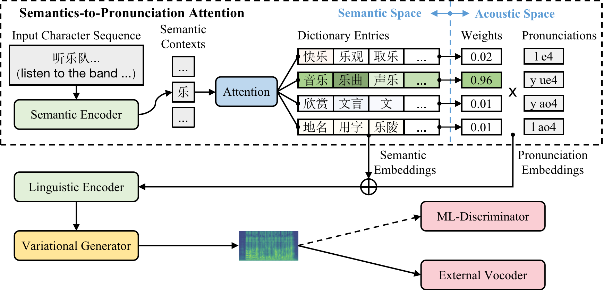

# Dict-TTS: Learning to Pronounce with Prior Dictionary Knowledge for Text-to-Speech

## Abstract

Polyphone disambiguation aims to capture accurate pronunciation knowledge from natural text sequences for reliable Text-to-speech (TTS) systems. However, previous approaches require substantial training data labeled by language experts, making it difficult to extend high-quality neural TTS systems to out-of-domain daily conversations and countless languages worldwide. This paper tackles the polyphone disambiguation problem from a concise and novel perspective: we propose Dict-TTS, a semantic-aware generative text-to-speech model with prior dictionary knowledge (the structured information in the natural language). Specifically, we design a semantics-to-pronunciation attention (S2PA) module to match the semantic patterns between the input text sequence and the prior semantics in the dictionary and obtain the corresponding pronunciations; The S2PA module can be easily trained with the end-to-end TTS model without any annotated phoneme labels. Experimental results in three languages show that our model outperforms several strong baseline models in terms of pronunciation accuracy and improves the prosody modeling of TTS systems. Further extensive analyses with different types of linguistic encoders demonstrate that each design in Dict-TTS is effective.

<div style="width:100%;">
</div>

## Audio Samples

We provide the audio samples generated by the TTS systems in the experiments from three datasets, including **BiaoBei** (a Mandarin dataset), **JSUT** (a Japanese dataset), and **Commonvoice-HK** (a Cantonese dataset).

### BiaoBei (Mandarin, single-speaker)

<ol>     
    <li>
      <ruby style="text-align: center;font-size: 20px;">鱼<rt>yú</rt></ruby>
      <ruby style="text-align: center;font-size: 20px;">在<rt>zài</rt></ruby>
        <ruby style="text-align: center;font-size: 20px;">水<rt>shuǐ</rt></ruby>
        <ruby style="text-align: center;font-size: 20px;">里<rt>lǐ</rt></ruby>
      <ruby style="text-align: center;font-size: 20px;">打<rt>dǎ</rt></ruby>
      <ruby style="text-align: center;font-size: 20px;">旋<rt>xuán</rt></ruby>
      <ruby style="text-align: center;font-size: 20px;">地<rt>de</rt></ruby>
      <ruby style="text-align: center;font-size: 20px;">往<rt>wǎng</rt></ruby>
      <ruby style="text-align: center;font-size: 20px;">外<rt>wài</rt></ruby>
      <ruby style="text-align: center;font-size: 20px;">乱<rt>luàn</rt></ruby>
      <ruby style="text-align: center;font-size: 20px;">蹦<rt>bèng</rt></ruby>
      <span style="font-size: 20px;"> <br> (Fish are swirling out in the water) </span>

    </li> 

  <table style='width: 100%;' name="cn">
      <thead>
      <tr>
        <th></th>
          <th align="center">GT</th>
          <th align="center">GT (voc.)</th>
      </tr>

      </thead>
      <tbody>
        <tr>
            <th scope="row">wav</th>
              <td><audio controls="" ><source src="" type="audio/wav"></audio></td>
              <td><audio controls="" ><source src="" type="audio/wav"></audio></td>
            <!-- <td><audio controls="" ><source src="" type="audio/wav"></audio></td> -->
        </tr>
      </tbody>
    
      <thead>
        <tr>
          <th></th>
            <th align="center">Character</th>
            <th align="center">Bert emb.</th>
            <th align="center">NLR</th>
        </tr>
            
        </thead>
        <tbody>
          <tr>
              <th scope="row">wav</th>
              <td><audio controls="" ><source src="" type="audio/wav"></audio></td>
              <td><audio controls="" ><source src="" type="audio/wav"></audio></td>
              <td><audio controls="" ><source src="" type="audio/wav"></audio></td>
          </tr>
        </tbody>
    
        <thead>
          <tr>
            <th></th>
              <th align="center">Phoneme (G2PM) </th>
              <th align="center">Phoneme (pypinyin)</th>
              <th align="center">Dict-TTS </th>
          </tr>
              
          </thead>
          <tbody>
            <tr>
                <th scope="row">wav</th>
                <td><audio controls="" ><source src="" type="audio/wav"></audio></td>
                <td><audio controls="" ><source src="" type="audio/wav"></audio></td>
                <td><audio controls="" ><source src="" type="audio/wav"></audio></td>
            </tr>
          </tbody>
  </table>  

  <li>
     <!-- 毋庸讳言,人有记性,亦有忘性 -->
    <ruby style="text-align: center;font-size: 20px;">毋<rt>wú</rt></ruby>
    <ruby style="text-align: center;font-size: 20px;">庸<rt>yōng</rt></ruby>
    <ruby style="text-align: center;font-size: 20px;">讳<rt>huì</rt></ruby>
    <ruby style="text-align: center;font-size: 20px;">言<rt>yán</rt></ruby>
    <ruby style="text-align: center;font-size: 20px;">,</ruby>
    <ruby style="text-align: center;font-size: 20px;">人<rt>rén</rt></ruby>
    <ruby style="text-align: center;font-size: 20px;">有<rt>yǒu</rt></ruby>
    <ruby style="text-align: center;font-size: 20px;">记<rt>jì</rt></ruby>
    <ruby style="text-align: center;font-size: 20px;">性<rt>xìng</rt></ruby>
    <ruby style="text-align: center;font-size: 20px;">
    , </ruby>
    <ruby style="text-align: center;font-size: 20px;">亦<rt>yì</rt></ruby>
    <ruby style="text-align: center;font-size: 20px;">有<rt>yǒu</rt></ruby>
    <ruby style="text-align: center;font-size: 20px;">忘<rt>wàng</rt></ruby>
    <ruby style="text-align: center;font-size: 20px;">性<rt>xìng</rt></ruby>
    <span style="font-size: 20px;"> <br> (Needless to say, people have memory and forgetfulness) </span>

  </li> 

  <table style='width: 100%;' name="cn">
    <thead>
    <tr>
      <th></th>
        <th align="center">GT</th>
        <th align="center">GT (voc.)</th>
    </tr>

    </thead>
    <tbody>
      <tr>
          <th scope="row">wav</th>
            <td><audio controls="" ><source src="" type="audio/wav"></audio></td>
            <td><audio controls="" ><source src="" type="audio/wav"></audio></td>
          <!-- <td><audio controls="" ><source src="" type="audio/wav"></audio></td> -->
      </tr>
    </tbody>
    
    <thead>
      <tr>
        <th></th>
          <th align="center">Character</th>
          <th align="center">Bert emb.</th>
          <th align="center">NLR</th>
      </tr>
          
      </thead>
      <tbody>
        <tr>
            <th scope="row">wav</th>
            <td><audio controls="" ><source src="" type="audio/wav"></audio></td>
            <td><audio controls="" ><source src="" type="audio/wav"></audio></td>
            <td><audio controls="" ><source src="" type="audio/wav"></audio></td>
        </tr>
      </tbody>
    
      <thead>
        <tr>
          <th></th>
            <th align="center">Phoneme (G2PM) </th>
            <th align="center">Phoneme (pypinyin)</th>
            <th align="center">Dict-TTS </th>
        </tr>
            
        </thead>
        <tbody>
          <tr>
              <th scope="row">wav</th>
              <td><audio controls="" ><source src="" type="audio/wav"></audio></td>
              <td><audio controls="" ><source src="" type="audio/wav"></audio></td>
              <td><audio controls="" ><source src="" type="audio/wav"></audio></td>
          </tr>
        </tbody>
</table>  

<li>
  <!-- 鸟儿喳喳，奏起晨曲 -->
  <ruby style="text-align: center;font-size: 20px;">鸟<rt>niǎo</rt></ruby>
  <ruby style="text-align: center;font-size: 20px;">儿<rt>er</rt></ruby>
  <ruby style="text-align: center;font-size: 20px;">喳<rt>zhā</rt></ruby>
  <ruby style="text-align: center;font-size: 20px;">喳<rt>zhā</rt></ruby>
  <ruby style="text-align: center;font-size: 20px;">,</ruby>
  <ruby style="text-align: center;font-size: 20px;">奏<rt>zòu</rt></ruby>
  <ruby style="text-align: center;font-size: 20px;">起<rt>qǐ</rt></ruby>
  <ruby style="text-align: center;font-size: 20px;">晨<rt>chén</rt></ruby>
  <ruby style="text-align: center;font-size: 20px;">曲<rt>qǔ</rt></ruby>
  <span style="font-size: 20px;"> <br> (Birds chirp and sing in the morning) </span>

</li> 

<table style='width: 100%;' name="cn">
  <thead>
  <tr>
    <th></th>
      <th align="center">GT</th>
      <th align="center">GT (voc.)</th>
  </tr>
  </thead>
  <tbody>
    <tr>
        <th scope="row">wav</th>
          <td><audio controls="" ><source src="" type="audio/wav"></audio></td>
          <td><audio controls="" ><source src="" type="audio/wav"></audio></td>
        <!-- <td><audio controls="" ><source src="" type="audio/wav"></audio></td> -->
    </tr>
  </tbody>

  <thead>
    <tr>
      <th></th>
        <th align="center">Character</th>
        <th align="center">Bert emb.</th>
        <th align="center">NLR</th>
    </tr>
        

    </thead>
    <tbody>
      <tr>
          <th scope="row">wav</th>
          <td><audio controls="" ><source src="" type="audio/wav"></audio></td>
          <td><audio controls="" ><source src="" type="audio/wav"></audio></td>
          <td><audio controls="" ><source src="" type="audio/wav"></audio></td>
      </tr>
    </tbody>
    
    <thead>
      <tr>
        <th></th>
          <th align="center">Phoneme (G2PM) </th>
          <th align="center">Phoneme (pypinyin)</th>
          <th align="center">Dict-TTS </th>
      </tr>
          
      </thead>
      <tbody>
        <tr>
            <th scope="row">wav</th>
            <td><audio controls="" ><source src="" type="audio/wav"></audio></td>
            <td><audio controls="" ><source src="" type="audio/wav"></audio></td>
            <td><audio controls="" ><source src="" type="audio/wav"></audio></td>
        </tr>
      </tbody>
</table>  

<li>
  <!-- 先师的研究领域浩瀚无涯矣 -->
  <ruby style="text-align: center;font-size: 20px;">先<rt>xiān</rt></ruby>
  <ruby style="text-align: center;font-size: 20px;">师<rt>shī</rt></ruby>
  <ruby style="text-align: center;font-size: 20px;">的<rt>de</rt></ruby>
  <ruby style="text-align: center;font-size: 20px;">研<rt>yán</rt></ruby>
  <ruby style="text-align: center;font-size: 20px;">究<rt>jiū</rt></ruby>
  <ruby style="text-align: center;font-size: 20px;">浩<rt>yíng</rt></ruby>
  <ruby style="text-align: center;font-size: 20px;">瀚<rt>hàn</rt></ruby>
  <ruby style="text-align: center;font-size: 20px;">无<rt>wú</rt></ruby>
  <ruby style="text-align: center;font-size: 20px;">涯<rt>yá</rt></ruby>
  <ruby style="text-align: center;font-size: 20px;">矣<rt>yǐ</rt></ruby>

  <span style="font-size: 20px;"> <br> (The research field of the master is vast and boundless) </span>
</li> 

<table style='width: 100%;' name="cn">
  <thead>
  <tr>
    <th></th>
      <th align="center">GT</th>
      <th align="center">GT (voc.)</th>
  </tr>
  </thead>
  <tbody>
    <tr>
        <th scope="row">wav</th>
          <td><audio controls="" ><source src="" type="audio/wav"></audio></td>
          <td><audio controls="" ><source src="" type="audio/wav"></audio></td>
        <!-- <td><audio controls="" ><source src="" type="audio/wav"></audio></td> -->
    </tr>
  </tbody>

  <thead>
    <tr>
      <th></th>
        <th align="center">Character</th>
        <th align="center">Bert emb.</th>
        <th align="center">NLR</th>
    </tr>
        
    </thead>
    <tbody>
      <tr>
          <th scope="row">wav</th>
          <td><audio controls="" ><source src="" type="audio/wav"></audio></td>
          <td><audio controls="" ><source src="" type="audio/wav"></audio></td>
          <td><audio controls="" ><source src="" type="audio/wav"></audio></td>
      </tr>
    </tbody>
    
    <thead>
      <tr>
        <th></th>
          <th align="center">Phoneme (G2PM) </th>
          <th align="center">Phoneme (pypinyin)</th>
          <th align="center">Dict-TTS </th>
      </tr>
          
      </thead>
      <tbody>
        <tr>
            <th scope="row">wav</th>
            <td><audio controls="" ><source src="" type="audio/wav"></audio></td>
            <td><audio controls="" ><source src="" type="audio/wav"></audio></td>
            <td><audio controls="" ><source src="" type="audio/wav"></audio></td>
        </tr>
      </tbody>
</table>  

  </ol>

  <script>
    function setSrcCN() {
      let cols = ["gt", "gt_vocoder", "ps_character", "ps_bertemb", "ps_nlr", "ps_adv_g2pm", "ps_adv", "ps_dict"]
      let files = 
      ['[000077][000078][P]鱼在水里打旋地往外乱蹦..wav', 
      '[000085][000086][P]毋庸讳言,人有记性,亦有忘性..wav',
      '[000064][000065][P]鸟儿喳喳,奏起晨曲..wav',
      '[000113][000114][P]先师的研究领域浩瀚无涯矣..wav']


      var x = document.getElementsByName("cn");
      let num = x.length;
      for(let i=0;i<num;i+=1) {
          var audios = x[i].getElementsByTagName("audio")
          for (let j=0;j<cols.length;j+=1) {
              if (j <= 1) fileName = files[i].replace("[P]", "[G]")
              else fileName = files[i]
              path = "audio_sample/biaobei/" + cols[j] + "/" + fileName
              audios[j].src = path
              console.log(path)
          }
      }
    }
    setSrcCN();
  </script>


### JSUT (Japanese, single-speaker)

  <ol>
    <li style="text-align: left;font-size: 20px;">末期試験に備えて本当に気合いを入れて勉強しなきゃ (
      I have to study hard in preparation for the final exam)</li> 
    <table style='width: 100%;' name="jp">
        <thead>
        <tr>
            <th></th>
            <th align="center">GT</th>
            <th align="center">GT (voc.)</th>
        </tr>
        </thead>
        <tbody>
        <tr>
            <th scope="row">wav</th>

            <td><audio controls="" ><source src="" type="audio/wav"></audio></td>
            <td><audio controls="" ><source src="" type="audio/wav"></audio></td>
        </tr>
    </tbody>
      <thead>
        <tr>
            <th></th>
            <!-- <th align="center">Phoneme (G2PM)</th> -->
            <th align="center">Character</th>
            <th align="center">Phoneme (pyopenjtalk) </th>
            <th align="center">Dict-TTS</th>
        </tr>
        </thead>
        <tbody>
        <tr>
            <th scope="row">wav</th>
            <td><audio controls="" ><source src="" type="audio/wav"></audio></td>
            <td><audio controls="" ><source src="" type="audio/wav"></audio></td>
            <td><audio controls="" ><source src="" type="audio/wav"></audio></td>
    
        </tr>
    </tbody>
    </table>


    <li style="text-align: left;font-size: 20px;">計画をたてることとそれを実行する事は別問題です (
      Making a plan and executing it are separate issues.)</li> 
      <table style='width: 100%;' name="jp">
        <thead>
        <tr>
            <th></th>
            <th align="center">GT</th>
            <th align="center">GT (voc.)</th>
        </tr>
        </thead>
        <tbody>
        <tr>
            <th scope="row">wav</th>
            
            <td><audio controls="" ><source src="" type="audio/wav"></audio></td>
            <td><audio controls="" ><source src="" type="audio/wav"></audio></td>
        </tr>
    </tbody>
      <thead>
        <tr>
            <th></th>
            <!-- <th align="center">Phoneme (G2PM)</th> -->
            <th align="center">Character</th>
            <th align="center">Phoneme (pyopenjtalk) </th>
            <th align="center">Dict-TTS</th>
        </tr>
        </thead>
        <tbody>
        <tr>
            <th scope="row">wav</th>
            <td><audio controls="" ><source src="" type="audio/wav"></audio></td>
            <td><audio controls="" ><source src="" type="audio/wav"></audio></td>
            <td><audio controls="" ><source src="" type="audio/wav"></audio></td>
    
        </tr>
    </tbody>
    </table>
    
    <li style="text-align: left;font-size: 20px;">迷惑をおかけして申し訳ありません (Sorry for the inconvenience) </li> 
    
    <table style='width: 100%;' name="jp">
      <thead>
      <tr>
          <th></th>
          <th align="center">GT</th>
          <th align="center">GT (voc.)</th>
      </tr>
      </thead>
      <tbody>
      <tr>
          <th scope="row">wav</th>
          
          <td><audio controls="" ><source src="" type="audio/wav"></audio></td>
          <td><audio controls="" ><source src="" type="audio/wav"></audio></td>
      </tr>
  </tbody>
    <thead>
      <tr>
          <th></th>
          <!-- <th align="center">Phoneme (G2PM)</th> -->
          <th align="center">Character</th>
          <th align="center">Phoneme (pyopenjtalk) </th>
          <th align="center">Dict-TTS</th>
      </tr>
      </thead>
      <tbody>
      <tr>
          <th scope="row">wav</th>
          <td><audio controls="" ><source src="" type="audio/wav"></audio></td>
          <td><audio controls="" ><source src="" type="audio/wav"></audio></td>
          <td><audio controls="" ><source src="" type="audio/wav"></audio></td>

      </tr>
  </tbody>
  </table>

  </ol>

  <script>
    function setSrcJP() {
      let cols = ["gt", "gt_vocoder", "ps_character", "ps_phoneme", "ps_dict"]
      let files = [ "[000009][BASIC5000_0010][G]末期試験に備えて本当に気合いを入れて勉強しなきゃ.wav", "[000051][BASIC5000_0052][G]計画をたてることとそれを実行する事は別問題です.wav", '[000058][BASIC5000_0059][G]迷惑をおかけして申し訳ありません.wav',]
      let dict_files = ["[000009][BASIC5000_0010][P]マッ期シ験ニソナエテ本トニ気合ヲイレテベン強シナキャ.wav", "[000051][BASIC5000_0052][P]ケ画ヲタテルコトトソレヲジッ行スル事ワベツ問ダイデス.wav", '[000058][BASIC5000_0059][P]メワクヲオカケシテモシ訳アリマセン.wav',]

      var x = document.getElementsByName("jp")
      let num = x.length
      console.log("jp: ", num)
      for(let i=0;i<num;i+=1) {
          var audios = x[i].getElementsByTagName("audio")
          for (let j=0;j<cols.length;j+=1) {
              if (cols[j] === "gt") {
                  let pattern = /\[(.+?)\]/g
                  let result = files[i].match(pattern)
                  fileName = result[1]
                  fileName = fileName.replace("[", "").replace("]", "") + ".wav"
              }
              else if (cols[j] === "gt_vocoder") fileName = files[i]
              else if (cols[j] === "ps_dict") fileName = dict_files[i]
              else fileName = files[i].replace("[G]", "[P]")
    
              path = "audio_sample/jsut/" + cols[j] + "/" + fileName
              audios[j].src = path
              console.log(path)
          }
      }
  }
  setSrcJP();
  </script>

### CommonVoice-HK (Cantonese, single-speaker)
<ol>
    <li style="text-align: left;font-size: 20px; ">有個老人去左牛池灣沐翠街食齋 (The old man went to Niuchi Bay Mucui Street to eat vegetarian)</li> 
    <table style='width: 100%;' name="hk">
        <thead>
        <tr>
            <th></th>
            <th align="center">GT</th>
            <th align="center">Character </th>
        </tr>
        </thead>
        <tbody>
        <tr>
            <th scope="row">wav</th>
            <td><audio controls="" ><source src="" type="audio/wav"></audio></td>
            <td><audio controls="" ><source src="" type="audio/wav"></audio></td>
        </tr>
    </tbody>
        <thead>
        <tr>
            <th></th>
            <th align="center">Phoneme(pycantonese) </th>
            <th align="center">Dict-TTS</th>
        </tr>
        </thead>
        <tbody>
        <tr>
            <th scope="row">wav</th>
            <td><audio controls="" ><source src="" type="audio/wav"></audio></td>
            <td><audio controls="" ><source src="" type="audio/wav"></audio></td>
        </tr>
    </tbody>
    </table>

    <li style="text-align: left;font-size: 20px; ">呃得一時唔呃得一世 (You can cheat for a while, but you can't cheat for a lifetime)</li> 
    <table style='width: 100%;' name="hk">
        <thead>
        <tr>
            <th></th>
            <th align="center">GT</th>
            <th align="center">Character</th>
        </tr>
        </thead>
        <tbody>
        <tr>
            <th scope="row">wav</th>
            <td><audio controls="" ><source src="" type="audio/wav"></audio></td>
            <td><audio controls="" ><source src="" type="audio/wav"></audio></td>
        </tr>
    </tbody>
        <thead>
        <tr>
            <th></th>
            <th align="center">Phoneme(pycantonese)</th>
            <th align="center">Dict-TTS</th>
        </tr>
        </thead>
        <tbody>
        <tr>
            <th scope="row">wav</th>
            <td><audio controls="" ><source src="" type="audio/wav"></audio></td>
            <td><audio controls="" ><source src="" type="audio/wav"></audio></td>
        </tr>
    </tbody>
    </table>
    
    <li style="text-align: left;font-size: 20px; ">試看前幾天街上男女的樣子 (Just look at the men and women on the street a few days ago)</li> 
    <table style='width: 100%;' name="hk">
        <thead>
        <tr>
            <th></th>
            <th align="center">GT</th>
            <th align="center">Character</th>
        </tr>
        </thead>
        <tbody>
        <tr>
            <th scope="row">wav</th>
            <td><audio controls="" ><source src="" type="audio/wav"></audio></td>
            <td><audio controls="" ><source src="" type="audio/wav"></audio></td>
        </tr>
    </tbody>
        <thead>
        <tr>
            <th></th>
            <th align="center">Phoneme(pycantonese)</th>
            <th align="center">Dict-TTS</th>
        </tr>
        </thead>
        <tbody>
        <tr>
            <th scope="row">wav</th>
            <td><audio controls="" ><source src="" type="audio/wav"></audio></td>
            <td><audio controls="" ><source src="" type="audio/wav"></audio></td>
        </tr>
    </tbody>
    </table>

  </ol>
    
  <script>
    function setSrcHK() {
      let cols = ["gt", "ps_wordonly", "ps_adv", "ps_dict"]
      let files = ['[000072][spk_76_common_voice_zh-HK_22263131][G]有個老人去左牛池灣沐翠街食齋.wav',
'[000089][spk_2064_common_voice_zh-HK_22411403][G]呃得一時唔呃得一世.wav', "[000056][spk_2018_common_voice_zh-HK_23001919][G]試看前幾天街上男女的樣子.wav"]

      var x = document.getElementsByName("hk");
      let num = x.length;
      for(let i=0;i<num;i+=1) {
          var audios = x[i].getElementsByTagName("audio")
          for (let j=0;j<cols.length;j+=1) {
              if (j > 0) fileName = files[i].replace("[G]", "[P]")
              else fileName = files[i]
              path = "audio_sample/Commonvoice-HK/" + cols[j] + "/" + fileName
              audios[j].src = path
              console.log(path)
          }
      }
  }
  setSrcHK()
  </script>

## Verification Code

*You can try the following scripts to verify the G2P pipelines' errors shown in the demo page. This work is done at May.20 2022. Please choose the corresponding version of the G2P pipelines.*

```python
# pip install pypinyin==0.46.0
import pypinyin
res = pypinyin.pinyin("鸟儿喳喳，奏起晨曲")
print(res)
# [['niǎo'], ['ér'], ['zhā'], ['zhā'], ['，'], ['zòu'], ['qǐ'], ['chén'], ['qū']]

# pip install g2pM
from g2pM import G2pM
model = G2pM()
res = model("鸟儿喳喳，奏起晨曲", tone=True, char_split=True)
print(res)
# ['niao3', 'er2', 'cha1', 'zha1', '，', 'zou4', 'qi3', 'chen2', 'qu3']
```

